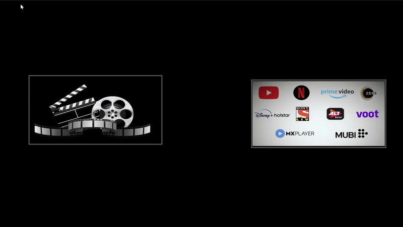

# IMDB + OTT Platforms Movies Dashboard 

A comprehensive Power BI dashboard analyzing movies and TV shows across major streaming platforms and cinema industries, providing insights into content distribution, ratings, revenue, and viewing trends.

## 🎬 Project Showcase

<p align="center">
  
</p>

<div align="center">
  <h3><strong>Don't forget to leave a star ⭐️</strong></h3>
</div>

> **Note**: This is my first project in the data analyst field. This project was created by me and my friends in 2023.

## 📊 Dashboard Overview

This dynamic Power BI dashboard provides detailed analytics for movies and TV shows across multiple platforms:

### Streaming Platforms Covered:
- **Disney+ Hotstar** 🏰
- **Netflix** 📺
- **Amazon Prime Video** 📦
- **Apple TV+** 🍎
- **IMDB Database** 🎭

### Cinema Industries:
- **Hollywood** 🇺🇸
- **Bollywood** 🇮🇳

## 🔍 Key Features

### 📈 Analytics & Insights
- **Revenue Analysis**: Box office performance and budget comparisons
- **Genre Distribution**: Popular genres across platforms and regions
- **Release Trends**: Content release patterns over time
- **Rating Analytics**: User ratings and scoring trends
- **Geographic Distribution**: Content production by country
- **Platform Comparison**: Cross-platform content analysis

### 📊 Interactive Visualizations
- Dynamic filters for date ranges, genres, and platforms
- Interactive maps showing global content distribution
- Comprehensive charts and graphs for data exploration
- Real-time filtering and drill-down capabilities

## 📋 Dataset Structure

### Amazon Prime Video
```
show_id: Unique identifier for each show
type: Content type (Movie/TV Show)
title: Name of the content
director: Director(s) name
cast: Main actors/actresses
country: Production country
date_added: Date when added to platform
release_year: Original release year
rating: Content rating (PG, R, etc.)
duration: Runtime (minutes for movies, seasons for shows)
listed_in: Genre categories
description: Content summary
```

### Netflix
```
type: Content type (Movie/TV Show)
title: Name of the content
director: Director(s) name
cast: Main actors/actresses
country: Production country
date_added: Date when added to platform
release_year: Original release year
rating: Content rating (PG, R, etc.)
duration: Runtime information
listed_in: Genre categories
description: Content summary
day_added: Specific day when content was added
year_added: Year when content was added
month_added: Month when content was added
[Genre Categories]: Individual genre columns (Teen_TV_Shows, Horror_Movies, etc.)
User_Rating: User-generated ratings
```

### Disney+ Hotstar
```
title: Name of the content
description: Content summary
genre: Content category
year: Release year
age_rating: Age-appropriate rating
running_time: Duration in minutes
type: Content type (Movie/TV Show)
```

### Apple TV+
```
id: Unique content identifier
title: Name of the content
type: Content type (Movie/TV Show)
description: Content summary
release_year: Original release year
age_certification: Age rating classification
runtime: Duration in minutes
genres: Content categories
production_countries: Countries where produced
seasons: Number of seasons (for TV shows)
imdb_id: IMDB database identifier
imdb_score: IMDB user rating
imdb_votes: Number of IMDB votes
tmdb_popularity: The Movie Database popularity score
tmdb_score: The Movie Database user rating
```

### Hollywood Movies
```
Title: Movie name
Date: Release date
Genre: Movie category
orig_lang: Original language
Revenue($): Box office earnings in USD
Budget($): Production cost in USD
country: Production country
score: Critical/User rating
```

### Bollywood Movies
```
title: Movie name
date: Release date
genre: Movie category
language: Primary language
revenue: Box office earnings
budget: Production cost
country: Production country
score: Critical/User rating
```

## 🎯 Key Metrics Displayed

### Platform-Specific Metrics
- **Total Content Count**: Movies vs TV Shows distribution
- **Genre Breakdown**: Most popular content categories
- **Rating Distribution**: Content ratings across age groups
- **Release Timeline**: Content addition patterns over years

### Financial Analytics
- **Revenue Analysis**: Box office performance tracking
- **Budget vs Revenue**: ROI analysis for productions
- **Market Performance**: Regional and global revenue trends

### Content Quality Metrics
- **Average Scores**: User and critic ratings
- **Popular Titles**: Top-performing content by platform
- **Duration Analysis**: Runtime distribution patterns

## 📱 Dashboard Pages

1. **Hollywood Overview**: Box office analytics, genre distribution, revenue trends
2. **Bollywood Insights**: Regional content analysis, language distribution, revenue metrics
3. **Disney+ Analytics**: Content categorization, family-friendly metrics, release patterns
4. **Netflix Intelligence**: Global content distribution, viewing patterns, genre preferences
5. **Amazon Prime Stats**: Platform-specific content analysis and user engagement
6. **Apple TV+ Metrics**: Premium content analytics, quality scores, production insights

## 📊 Sample Insights

- **Content Volume**: Netflix leads with 5,329 titles, followed by Amazon Prime with 9,655 titles
- **Genre Preferences**: Drama dominates across platforms, followed by Comedy and Action
- **Release Trends**: Significant increase in content production post-2015
- **Geographic Distribution**: Strong concentration in North America, Europe, and India
- **Rating Patterns**: Most content falls in TV-MA and TV-14 categories
